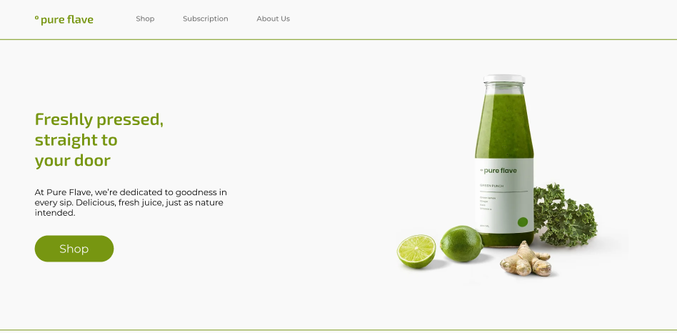
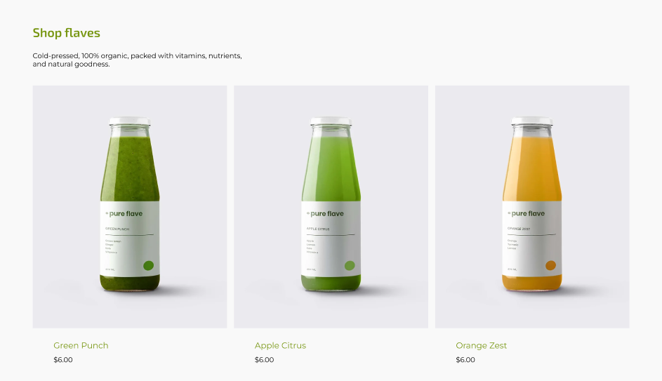
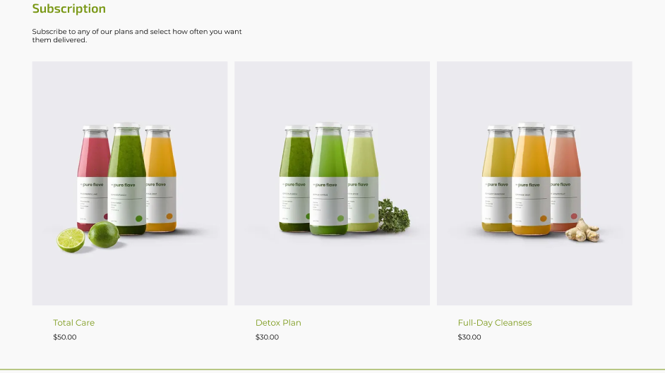
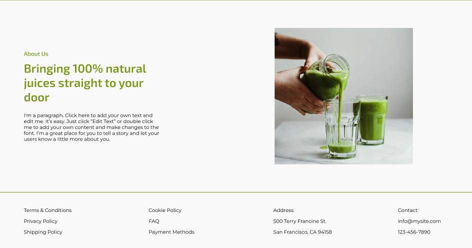

# Flaves shop
Hi my name is Kirill👋 I am interested in Front-end💻 This site has no commercial purpose I created it to gain experience and also to consolidate knowledge link to GIthub pages is in the description.
## Authors project
+ Thebestikk([Kirill Zakharov](https://github.com/TheBestikk))
## Tools and Language

## Roadmap
+ close inspection of the __figma__ layout
+ add files structure
    + add folder __images__
    + add file __index.html__
    + add file __style.css__
    + add fonts __Exo 2__, __Montserrat__
+ started writing the markup
+ end writing the markup
+ started writing styles the markup
+ end writing the markup
## Screenshoots layout

